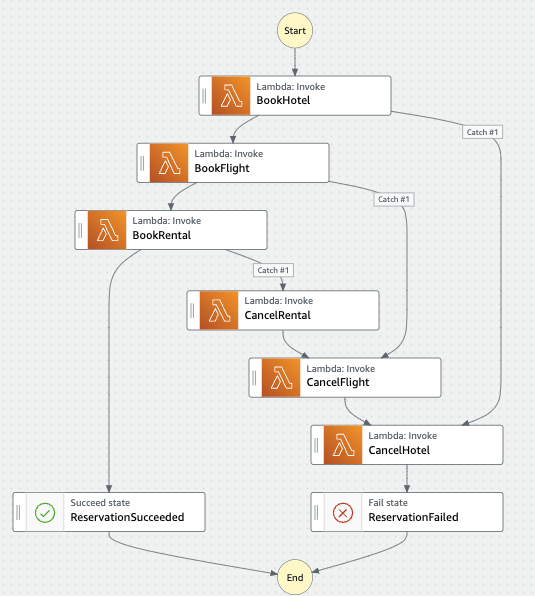

# Implementing SAGA Pattern
The SAGA pattern is a failure management pattern, that provides us the means to establish semantic consistency in our distributed applications by providing compensating transactions for every transaction where you have more than one collaborating services or functions.

To read more about it, please refer to the official paper https://www.cs.cornell.edu/andru/cs711/2002fa/reading/sagas.pdf.

## Step Functions
I am using **AWS Step Functions** to implement the *SAGA pattern*.

**What is AWS Step Functions?**

*AWS Step Functions is a fully managed service that makes it easy to coordinate the components of distributed applications and microservices using visual workflows. Building applications from individual components that each perform a discrete function lets you scale easily and change applications quickly. Step Functions is a reliable way to coordinate components and step through the functions of your application. Step Functions automatically triggers and tracks each step, and retries when there are errors, so your application executes in order and as expected. Step Functions logs the state of each step, so when things do go wrong, you can diagnose and debug problems quickly. You can change and add steps without even writing code, so you can easily evolve your application and innovate faster.*

## How to run it
I am using **terraform** to provision and deploy the resources used in this example. 

### Prerequisites
- Make sure to have terraform installed prior to running the example. Feel free to refer to the [official page](https://learn.hashicorp.com/tutorials/terraform/install-cli) to install it.

- Make sure you have [aws cli](https://docs.aws.amazon.com/cli/latest/userguide/getting-started-install.html) installed and configured.

I am using the **us-east-1** as a region. You can change [here](./provider.tf#L12).

```
terraform apply -auto-approve
```

## Resources Deployed
| Resource Name  | Resource Type | Resource Description
| ------------- | ------------- | ------------- |
| BookHotel     | Lambda Function | The function responsible for creating a record in BookHotel dynamodb table
| BookFlight    | Lambda Function  | The function responsible for creating a record in BookFlight dynamodb table
| BookRental     | Lambda Function | The function responsible for creating a record in BookRental dynamodb table
| CancelHotel    | Lambda Function  | The function responsible for deleting a record in BookHotel dynamodb table
| CancelFlight     | Lambda Function | The function responsible for deleting a record in BookFlight dynamodb table 
| CancelRental    | Lambda Function  | The function responsible for deleting a record in BookRental dynamodb table
| Reservation-lambda     | IAM Role | The role assumed by the Reservation Step Function, granting it the necessary permissions to invoke the lambda functions
| Function_Iam_Role_BookHotel     | IAM Role | The role assumed by the BookHotel Function
| Function_Iam_Role_BookFlight     | IAM Role | The role assumed by the BookFlight Function
| Function_Iam_Role_BookRental     | IAM Role | The role assumed by the BookRental Function
| Function_Iam_Role_CancelHotel     | IAM Role | The role assumed by the CancelHotel Function
| Function_Iam_Role_CancelFlight     | IAM Role | The role assumed by the CancelFlight Function
| Function_Iam_Role_CancelRental     | IAM Role | The role assumed by the CancelRental Function
| hotel_dynamo_db_delete_policy    | IAM Policy | The Policy attached to the role Function_Iam_Role_CancelHotel granting permissing to delete a record from the BookHotel table 
| hotel_dynamo_db_write_policy    | IAM Policy | The Policy attached to the role Function_Iam_Role_BookHotel granting permissing to create a record in the BookHotel table 
| flight_dynamo_db_delete_policy    | IAM Policy | The Policy attached to the role Function_Iam_Role_CancelFlight granting permissing to delete a record from the BookFlight table 
| flight_dynamo_db_write_policy    | IAM Policy | The Policy attached to the role Function_Iam_Role_BookFlight granting permissing to create a record in the BookFlight table 
| rental_dynamo_db_delete_policy    | IAM Policy | The Policy attached to the role Function_Iam_Role_CancelRental granting permissing to delete a record from the BookRental table 
| rental_dynamo_db_write_policy    | IAM Policy | The Policy attached to the role Function_Iam_Role_BookRental granting permissing to create a record in the BookRental table 
| Reservation    | Step Function | The step function that is orchestrating the SAGA pattern
| BookFlight    | DynamoDB Table  | 
| BookHotel    | DynamoDB Table  |
| BookRental    | DynamoDB Table  |
| /aws/lambda/BookFlight | Cloudwatch Log Group | Specifying retention period of 30 days |
| /aws/lambda/BookHotel | Cloudwatch Log Group | Specifying retention period of 30 days |
| /aws/lambda/BookRental | Cloudwatch Log Group | Specifying retention period of 30 days |
| /aws/lambda/CancelFlight | Cloudwatch Log Group | Specifying retention period of 30 days |
| /aws/lambda/CancelHotel | Cloudwatch Log Group | Specifying retention period of 30 days |
| /aws/lambda/CancelRental | Cloudwatch Log Group | Specifying retention period of 30 days |

## Sample application
### Scenario
In this example, we are implementing a simple *reservation* application/workflow.
We try to book a hotel, if it is a success, we book a flight, if it is a success we book a rental. If booking the rental is a success, we happily end the workflow with a Success state.



### Success Scenario
To run the step function, go to the aws console web page, be sure to select the correct region **(default: us-east-1)**, select the **"Reservation"** from the list of state machines. Click the **"Start Execution"** button and provide the following input:

```
{
    "confirmation_id": "1a41e714-4b8c-11ed-bdc3-0242ac120002",
    "checkin_date": "insert date",
    "checkout_date": "insert date"
}
```

No need to verify the dates, as those are not relevant to our example.


### Failed scenario
This app can intentionnaly fail in 3 different areas.

1. If you provide a confirmation_id starting with 11, BookHotel lambda function will throw an error. The step Function will then invoke the CancelHotel function to delete the record from the BookHotel table ([diagram](./docs/images/scenario-fail-booking-hotel.png))
2. If you provide a confirmation_id starting with 22, BookFlight lambda function will throw an error. The step Function will then invoke the CancelFlight function to delete the record from the BookFlight table, after that, the step function will invoke the CancelHotel. ([diagram](./docs/images/scenario-fail-booking-flight.png))
3. If you provide a confirmation_id starting with 33, BookRental lambda function will throw an error. The step Function will then invoke the CancelRental function to delete the record from the BookRental table, after that, the step function will invoke the CancelFlight and so on, until we revert all the transactions.  ([diagram](./docs/images/scenario-fail-booking-rental.png))

## Cleanup
Don't forget to clean everything up by running:

```
terraform destroy -auto-approve
```